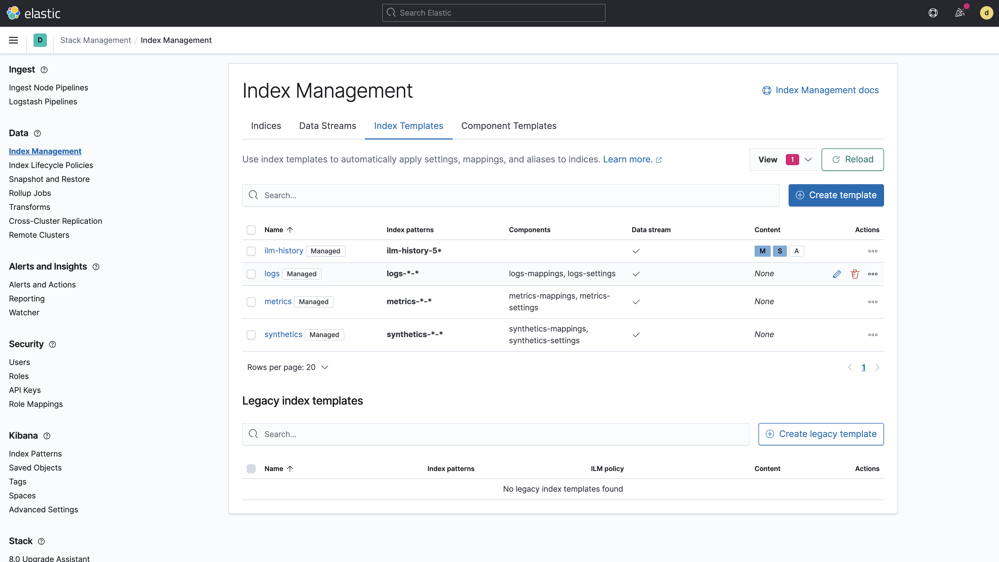

# Demo scripts used for Elastic Daily Bytes - Index Templates V2


## Setup

The setup will check that Elasticsearch and Kibana are running and will upload the component templates and the templates which are available in `elasticsearch-config` dir.

It will also remove any index template or index named `test*`.

### Run on cloud (recommended)

This specific configuration is used to ingest the whole bano dataset on a [cloud instance](https://cloud.elastic.co).
You need to create a `.cloud` local file which contains:

```
CLOUD_ID=the_cloud_id_you_can_read_from_cloud_console
CLOUD_PASSWORD=the_generated_elastic_password
```

Run:

```sh
./setup.sh
```

### Run Locally

Run Elastic Stack:

```sh
docker-compose down -v
docker-compose up
```

And run:

```sh
./setup.sh
```

## Demo part

Open the Stack Management in Kibana and go to Index Management.
Highlight the managed templates which already exists and hide them.



Explain that our templates are made here of several components. We can find those component templates in the "Component Templates" tab. Filter the names with `test-`.


### Component templates

Let's have a look on how you can create a component template. Name it `test-component`.


Add the following index settings:

```json
{
  "number_of_replicas": 1
}
```


Add a `textfield`and a `datefield`.


And show all the options you can edit later on if you edit the text field or the date field.


Do not define any alias and review the component before saving it.


### Index templates

Go back to the Index Templates tab and chow how to create a new template `test-new-template` that applies to index patterns `test-*`.


Add some component templates like:

* `test-settings-5shards`
* `test-settings-1replica`
* `test-mapping-timestamp`
* `test-mapping-ip`
* `test-alias`

And preview the rendering.


Explain that you can always overwrite settings coming from the component templates or add specific fields in the mapping like `specificfield`.


The preview tab gives you an idea of what the template will look like.


If you click on "Create template", you will see an error message:

```
index template [test-new-template] has index patterns [test-*] matching patterns from existing templates [test-simple] with patterns (test-simple => [test-*]) that have the same priority [0], multiple index templates may not match during index creation, please use a different priority
```

Go to the Logistics tab and change the priority to `300`. Go back to the next tab and create the template.

### Simulate index names

Open Dev Tools and simulate an index name `test-foo`:

```
POST /_index_template/_simulate_index/test-foo
```

Show that we have our settings, fields and that we are overlapping 2 index templates `test-simple` and `test-overwrite`.

Show other examples:

```
POST /_index_template/_simulate_index/logs-foo
POST /_index_template/_simulate_index/logs-foo-bar
POST /_index_template/_simulate_index/metrics-foo-bar
```


