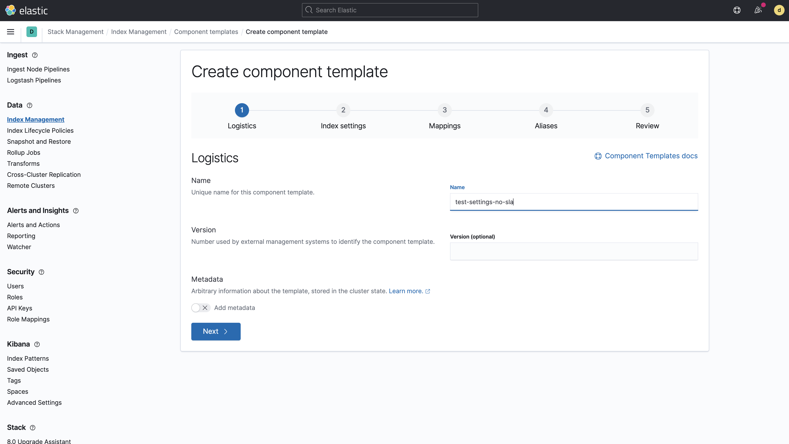
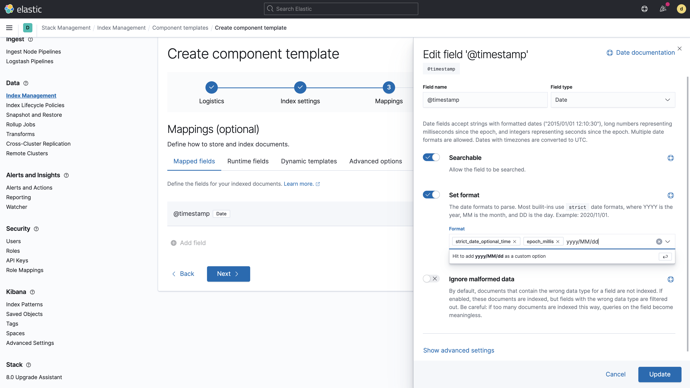
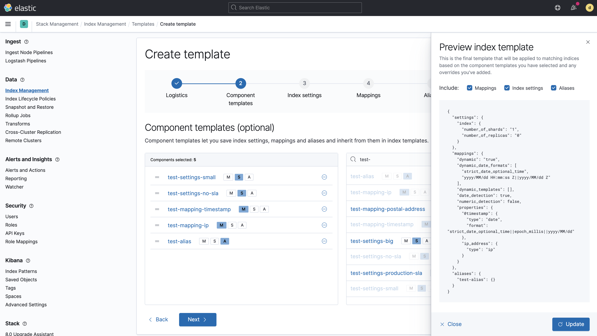

# Demo scripts used for Elastic Daily Bytes - Index Templates V2


## Setup

The setup will check that Elasticsearch and Kibana are running and will upload the component templates and the templates which are available in `elasticsearch-config` dir.

It will also remove any index template or index named `test*`.

### Run on cloud (recommended)

This specific configuration is used to ingest the whole bano dataset on a [cloud instance](https://cloud.elastic.co).
You need to create a `.cloud` local file which contains:

```
CLOUD_ID=the_cloud_id_you_can_read_from_cloud_console
CLOUD_PASSWORD=the_generated_elastic_password
```

Run:

```sh
./setup.sh
```

### Run Locally

Run Elastic Stack:

```sh
docker-compose down -v
docker-compose up
```

And run:

```sh
./setup.sh
```

## Demo part

Open the Stack Management in Kibana and go to Index Management.
Highlight the managed templates which already exists.


### Component templates

Open the "Component Templates" tab and let's have a look on how you can create a component template. Name it `test-settings-no-sla`.



Add the following index settings:

```json
{
  "number_of_replicas": 0
}
```

And save it.

Create another one named `test-mapping-timestamp` with a `@timestamp` as a `date` field.
You can also show all the options you can edit later on if you edit the date field.



Also, highlight the new "Runtime fields" option which is now available.


### Create a bunch of component templates

We can also use "dev tools" to create some of the templates we need:

```
## Some index settings as components

PUT /_component_template/test-settings-small
{
  "template": {
    "settings": {
      "index": {
        "number_of_shards": 1
      }
    }
  }
}

PUT /_component_template/test-settings-big
{
  "template": {
    "settings": {
      "index": {
        "number_of_shards": 5
      }
    }
  }
}

PUT /_component_template/test-settings-production-sla
{
  "template": {
    "settings": {
      "index": {
        "number_of_replicas": 1
      }
    }
  }
}

## Some index mappings as components

PUT /_component_template/test-mapping-ip
{
  "template": {
    "mappings": {
      "properties": {
        "ip_address": {
          "type": "ip"
        }
      }
    }
  }
}

PUT /_component_template/test-mapping-postal-address
{
  "template": {
    "settings": {
      "index": {
        "analysis": {
          "analyzer": {
            "city_analyzer": {
              "type": "custom",
              "tokenizer": "standard",
              "filter": [
                "lowercase",
                "asciifolding"
              ]
            }
          }
        }
      }
    },
    "mappings": {
      "properties": {
        "address": {
          "properties": {
            "city": {
              "type": "text",
              "analyzer": "city_analyzer"
            },
            "zipcode": {
              "type": "keyword"
            }
          }
        }
      }
    }
  }
}

PUT /_component_template/test-alias
{
  "template": {
    "aliases": {
      "test-alias": { }
    }
  }
}
```

### Index templates

Go back to the Index Templates tab and show how to create a new template `test-simple` that applies to index patterns `test-*`.


Add some component templates like:

* `test-settings-small`
* `test-settings-no-sla`
* `test-mapping-timestamp`
* `test-mapping-ip`
* `test-alias`

And preview the rendering.



Explain that you can always overwrite settings coming from the component templates or add specific fields in the mapping like `specificfield`.


The preview tab gives you an idea of what the template will look like.


Click on "Create template". Done.

Let's create a new one `test-overwrite` which uses now:

* `test-settings-small`
* `test-settings-production-sla`
* `test-mapping-timestamp`
* `test-mapping-ip`
* `test-alias`

If you click on "Create template", you will see an error message:


```
index template [test-overwrite] has index patterns [test-*] matching patterns from existing templates [test-simple] with patterns (test-simple => [test-*]) that have the same priority [0], multiple index templates may not match during index creation, please use a different priority
```

Go to the Logistics tab and change the priority to `300`. Go back to the next tab and create the template.


### Simulate index names

Open Dev Tools and simulate an index name `test-foo`:

```
POST /_index_template/_simulate_index/test-foo
```

Show that we have our settings, fields and that we are overlapping the index template `test-simple`. It can be on purpose but at least we are aware of it.

Change the component `test-settings-small` with 2 shards instead of one:

```
PUT /_component_template/test-settings-small
{
  "template": {
    "settings": {
      "index": {
        "number_of_shards": 2
      }
    }
  }
}
```

And simulate again:

```
POST /_index_template/_simulate_index/test-foo
```

We can see that our index template is updated with that change. We can update one component template which will update all the index templates which are using it.

From the UI we can also remove non used compnent templates like `test-mapping-postal-address`.

